# Instagram-klooni arkkitehtuuri

## Yleiskuvaus

Sovellus on full-stack web-sovellus, joka on toteutettu kevyenä kloonina Instagram sovelluksesta. Arkkitehtuuri nojaa Docker konttiteknologiaan ja sovellus on jaettu kolmeen eri konttiin: käyttöliittymä, palvelin ja tietokanta.

## Komponentit

### Frontend

- **Teknologia**: React + TypeScript + Vite
- **Tyylitys**: TailwindCSS
- **Palvelin**: Nginx ja Google Cloud VM
- **Toiminnot**:
  - Käyttöliittymä kuvien jakamiseen ja kommentointiin
  - Käyttäjäprofiilit ja seuraaminen
  - Kommentit ja tykkäykset
  - Hakutoiminnot

#### Tilanhallinta ja rajapintakutsut

Käyttöliittymä on toteutettu hyvin yksinkertaisesti ilman ulkopuolisia tilanhalintakirjastoja. Yleiseen tilanhallintaan on käytetty Reactin Contextia ja sinne on tallennettu lähinnä autentikaatioon liittyvää dataa. Rajapintakutsut on toteutettu käyttämällä hookkeja yleensä yksi hook per rajapinnan käyttötapaus. Eri hookkeja on kuitenkin jo tässä vaiheessa todella monta ja niiden ylläpito on raskasta ja duplikaattikoodia on todella paljon. Siksi olisi parempi käyttää esimerkiksi Redux toolkit kirjastoa tai muuta tilanhallinta- ja rajapintakutsukirjastoa, jotta ylimääräistä toistoa voisi vähentää.

Esimerkiksi `PostModal.tsx` komponentti käyttää hookkia kommenttien poistamiseen.

```JSX
 const { deleteComment } = useDeleteComment();
```

Hookin logiikka, jossa tehdään HTTP kutsu haluttuun rajanpintan ja käsitellään vastaus. `Callback` on vapaaehtoinen funktio, joka ajetaan jos vastaus on OK. Tässä käyttäjän JWT-token lisätään headereissa HTTP kutsuun.

```TypeScript
// ....
      const response = await fetch(
        `${import.meta.env.VITE_API_URL}/post/comment/remove/${commentId}`,
        {
          method: 'DELETE',
          credentials: 'include',
          headers: {
            Authorization: `Bearer ${token}`,
          },
        }
      );

      if (!response.ok) {
        toast.error('Error updating message');
        return;
      }

      callBack?.();
// ....
```

#### Navigaatio

Navigaatio on toteutettu käyttämällä `react-router-dom` kirjastoa. React sovellukset ovat yleensä SPA-tyylisiä, joten ne tarvitsevat reitittämiseen ja navigointiin työkaluja.

Reititys on toteutettu niin, että uloimpana on `AuthRouter`, joka lukee käyttäjän tokenin käyttöliittymällä ja ohjaa käyttäjän kirjautumissivulle, mikäli käyttäjällä ei ole tokenia tai se on vanhentunut. Jos token on kunnossa navigaatiosta ja reitittämisestä huolehtii muu reititys.

``` JSX
  <Routes>
    <Route path="/" element={<FrontPage />} />
    <Route path="/user/:username" element={<UserPage />} />
    <Route
      path="/hashtag/:hashtag"
      element={<PostsWithHashtag />}
    />
    <Route path="/conversations" element={<ConversationList />} />
    <Route path="/conversation/:id" element={<Conversation />} />
    <Route path="*" element={<Navigate to="/" replace />} />
  </Routes>

```

`path` ja `element` määrittävät sen komponentin, joka näytetään kun käyttäjä navigoi sovelluksessa. Sovellus lukee reittejä ylhäältä alas ja viimeinen jokeri ohjaa käyttäjän `/` osoitteeseen mikäli käyttäjän syöttämää osoitetta ei ole.

Käyttöliittymä koostuu siis etusivusta, käyttäjän omasta sivusta, aihetunnisteella eli hashtagilla löytyvien postausten listasta, viestilistasta ja keskustelusivusta. Lisäksi reitistä huolimatta vasemmalla sivulla on aina sivunavigaatio.

### Backend

- **Teknologia**: NestJS + TypeORM
- **Autentikointi**: JWT-token
- **API**: REST-JSON
- Rajapintojen osoite on /api/v1/[**RAJANPINTA**], jossa v1 on rajapinnan versio ja RAJAPINTA on yksittäinen ns. controller eli mitä rajapinta koskee. Rajapinnat on pyritty järjestelemään niin, että ne ovat loogisesti samassa paikassa, mutta kuitenkaan tekemättä yhdestä controllerista liian monimutkaista. Esimerkiksi autentikaatio ja käyttäjähallinta on eriytetty omiin osiinsa.

Jokainen backendin kokonaisuus on jaettu kahteen osaan: controlleriin ja serviceen. Controller hoitaa rajapintojen end pointit eli osoitteet joihin HTTP kutsut tulevat. Service hoitaa kaiken ns. business logiikan ja palauttaa controllerille valmiksi käsitellyn datan, jonka controller palauttaa kutsun tekijälle.

Tässä sovelluksessa controllereja on:

- Auth
- Post
- File
- Follower
- Hashtag
- Message

ja jokaisella niillä on omat servicet. Serviceitä voi olla useampia, mikäli on tarvetta koodin siisteyden takia eritellä logiikkaa eri serviceihin. Jokaisella kokonaisuudella on oma modulinsa, joka on NestJS:n peruspalikoita. Moduli hoitaa dependency injection serviceihin ja controllereihin, sekä mahdollistaa servicejen käytön muissa moduleissa. Esimerkiksi post serviceä pystyy käyttämään message servicessä exporttaamalla se Post modulesta ja injectoimalla se message serviceen Message modulissa.

#### Rajapinnat

- Auth (sessiohallinta)
  - /auth/signUp POST
  - /auth/login POST

- Post (postaus)
  - /post/createPost POST
  - /post/getPosts/:username GET
  - /post/getPost/:postId GET
  - /post/getLikes/:postId GET
  - /post/getPostsWithHashTag/:hashtag GET
  - /post/comment POST
  - /post/edit/comment/:commentId PATCH
  - /post/like POST
  - /post/likeComment POST
  - /post/userFeed POST
  - /post/markSeen POST
  - /post/like DELETE
  - /post/comment/remove/:commentId DELETE
  - /post/:id DELETE

- Tiedostohallinta
  - /files/:filename GET

- Käyttäjähallinta
  - /users/profile/:username GET
  - /users/find/:query GET

- Seuraajien ja seurattavien hallinta
  - /followers/followers/:userId GET
  - /followers/following/:userId GET
  - /followers/follow/:username PATCH
  - /followers/unfollow/:username PATCH

- Tunnisteiden hallinta
  - /hashtags/find/:query GET

- Keskusteluihin liittyvät
  - /messages/getConversations GET
  - /messages/getConversation/:conversationId GET
  - /messages/createConversation POST
  - /messages/sendToConversation/:conversationId POST
  - /messages/deleteMessage/:messageId DELETE
  - /messages/deleteConversation/:conversationId DELETE

### Tietokanta

- **Teknologia**: PostgreSQL
- **Migraatiot**: TypeORM migraatiot tietokannan rakenteen hallintaan

Tietokannan ja backendin välinen liikenne on hoidettu käyttämällä TypeORM-kirjastoa. Tietokanta on mallinnettu ns. Entityillä, jotka kuvaavat tietokannan tauluja. TypeORM muokkaa tietokannasta tulevan tiedon entityiden mukaisesti ja hoitaa samalla taulujen väliset relaatiot.

Esimerkkinä osa user entitystä.

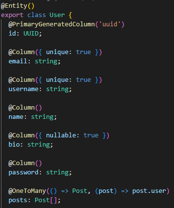

Muutoksia tietokantaan voi tehdä lisäämällä uusia kenttiä (property) entityyn. Esimerkiksi syntymäajan lisääminen tapahtuisi lisäämällä. Tämän jälkeen tietokantamuutos ajetaan tietokantaan luomalla migraatio ja ajamalla migraatio tietokantaan. Migraatiot ajetaan yleensä joka kerta kun palvelin käynnistyy uudelleen. Tieto jo ajetuista migraatiosta on tallennettu migrations tauluun.

```TypeScript
  @Column()
  birthYear: number;
```

Mikäli halutaan tarkempaa validaatiota siitä mitä ja minkä muotoista tietoa sarakkeeseen saa tallentaa voidaan lisätä `class-validator` kirjastosta dekoraattoreita hoitamaan validaatio.

```TypeScript
  @IsInt()
  @Min(1900)
  @Max(new Date().getFullYear())
  @Column()
  birthYear: number;
```

Lisäksi dekoraattorin parametriksi voidaan antaa objekti, jossa on `message` tieto, joka näkyy poikkeusviestissä, jos tieto ei ole oikeanmuotoista.

```TypeScript
  @IsInt({message: 'Tiedon täytyy olla kokonaisluku'})
```

Dekoraattoreita voi kirjoittaa omiakin, jos käyttötapaus niin vaatii. Mahdollista on myös lisätä ns. transformaatio dekoraattori, jos tarvitsee esimerkiksi purkaa tietokantaan tallennettua salattua dataa. TypeORM lukee tietokantaan tallennetun tiedon ja ajaa sen transformerin läpi ennen kuin palauttaa sen käytettäväksi. Transformerit toimivat myös toiseen suuntaan. Tällä voidaan minimoida business-logiikan seassa tapahtuvia datan muokkausoperaatioita.

Tässä sovelluksessa tietokantataulut on luotu käyttämällä pelkästään entityitä ja TypeORMin generoimia migraatioita. Indeksejä tässä tietokantatoteutuksessa ei ole käytetty, koska niille ei ole ollut näin pienessä mittakaavassa tarvetta, mutta niitäkin on mahdollista luoda käyttämällä esimerkiksi dekoraattoria

```TypeScript
@Index()
```

TypeORMilla voi luoda myös tyhjän migraation ja kirjoittaa migraatiologiikan itse, jos niin haluaa.

TypeORMin avulla tehdään pääsääntöisesti tietokantakutsuja käyttämällä ns. repositoryjä, jotka ovat jokaisen entityn eli tietokantataulun omia.

Esimerkiksi post servicessä on NestJS tapaan injektoitu Post entityn repository, jonka metodeja käyttämällä voidaan hakea tietoa `post` taulusta.

```TypeScript
  @InjectRepository(Post)
  private readonly postRepository: Repository<Post>,
```

Esimerkiksi tietyn `post` rivin hakeminen id:n perusteella tapahtuisi seuraavasti:

```TypeScript
  this.postRepository.findOne({where: {id: 'TÄHÄN ID'}})
```

josta saataisiin objekti mikäli sillä id:llä on olemassa rivi tai null, mikäli mitään ei löytynyt.

Repositoryjä on myös mahdollista luoda räätälöitynä toteutuksena, joka mahdollistaa esimerkiksi omien räätälöytyjen metodien luomisen. Tässä sovelluksessa on käytetty vain geneeristä tapaa luoda repositoryjä.

Toinen yleinen tapa on käyttää `createQueryBuilder` metodia, joka mahdollistaa SQL-tapaisen tietokantakutsun rakentamisen.

```TypeScript
  const seenPosts = await this.userSeenPostRepository
    .createQueryBuilder('userSeenPost')
    .where('userSeenPost.userId = :userId', { userId: user.id })
    .leftJoinAndSelect('userSeenPost.post', 'post')
    .select(['userSeenPost.id', 'post.id'])
    .getMany();
```

Tätä tapaa käytetään yleensä monimutkaisempien hakujen tapauksessa eli silloin kun halutaan käyttää esimerkiksi `OR` `IN` `NOT` `BETWEEN` tai monimutkaisempia `JOIN` määrityksiä. Mahdollista on myös luoda tietokantakutsu "raakana" SQL:nä, mutta siihen on harvoin tarvetta. Aikaisemmin TypeORMin repository metodit olivat rajallisempia, joten `queryBuilderia` joutui käyttämään useammin

#### ER-diagrammi

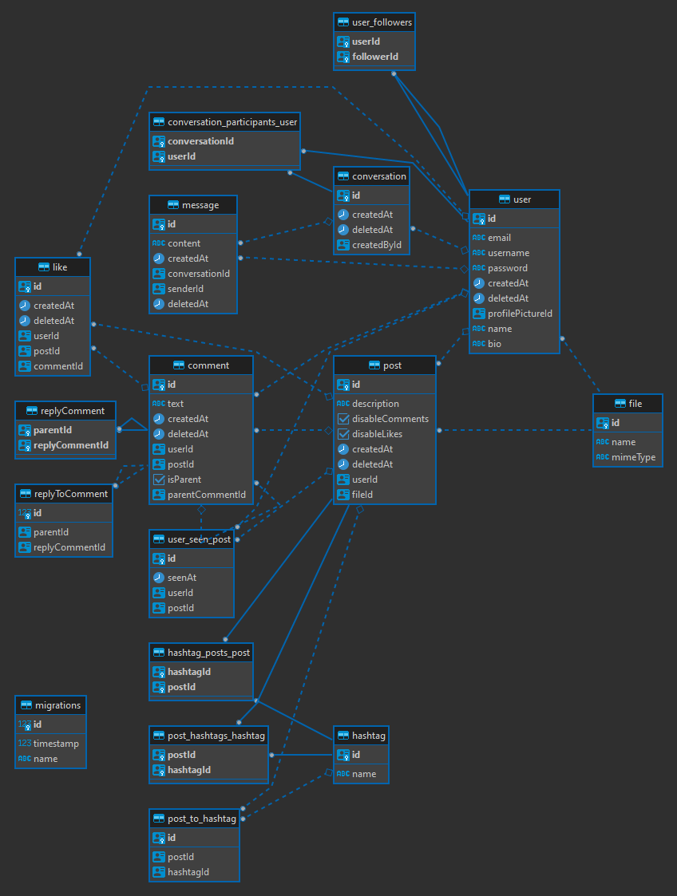

Tietokanta koostuu kuvan mukaisesti seitsemästätoista taulusta, joista yksi on TypeORM:n käyttämä migrations taulu. Päätauluja ovat user, post, comment, file, message, conversation ja hashtag ja loput ovat ns. välitauluja.

## Infrastruktuuri

### Tiedonsiirto

- Käyttöliittymä kommunikoi palvelimen kanssa HTTP API:n kautta
- Nginx toimii reverse proxy:nä, välittäen API-kutsut backend-palvelimelle
- Kuvat tallennetaan palvelimen tiedostojärjestelmään (`/uploads`)
- Muut tiedot tallenetaan relaatiotietokantaan

### Autentikointi

Jokainen rajapinta pl. sisäänkirjautuminen ja käyttäjän luonti on käyttäjän autentikaation takana.

Kun käyttäjä kirjautuu sisään luodaan käyttäjälle JWT-token, jonka avulla tiedetään kuka käyttäjä on ja käyttäjä voi käyttää sovellusta vapaasti. JWT-token välitetään jokaisessa käyttöliittymän HTTP pyynnössä palvelimelle.

Tämä on toteutettu käyttämällä NestJS:n `@UseGuard` ja NestJS Passport kirjaston `@AuthGuard` dekoraattoria ja `PassportStrategyä`, joka tässä tapauksessa lukee HTTP pyynnöstä käyttäjän JWT tokenin. Ns. stratregyjä voi olla useampaa erilaista esimerkiksi lisäksi voisi olla Google strategy, joka autentikoisi käyttäjän Googlen SSO:n perusteella.

Käyttö controllerin endpointissa

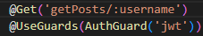

`JwtStrategy` validaatio, joka purkaa JWT-tokenin HTTP pyynnöstä, validoi tokenin ja tarkistaa onko käyttäjä validi.

```TypeScript
  async validate({ userId }: AuthToken) {
  const user = await this.authService.validateUser(userId);

  if (!user) {
    throw new UnauthorizedException();
  }

  return user;
}
```

Lisäksi `JWTStrategy` lisää validoidut käyttäjätiedot HTTP pyyntöön joka välitetään alkuperäiselle  HTTP pyynnön kohteena olleelle rajapinnalle, joten ne ovat helposti käytettävissä aina ilman erillistä käyttäjähakua. `AuthGuard` toimii ns. middlewarena, joten se ei päästä autentikoimattomia pyyntöjä läpi rajanpintaan vaan tarvittaessa estää kutsun pääsemisen eteenpäin heittämällä poikkeuksen. On kuitenkin kehittäjän vastuulla muistaa lisätä kyseinen dekoraattori jokaiseen rajapinnan end pointtiin mikäli middlewarea ei käytetä globaalisti kaikkiin rajapintoihin.

## Deployment

Sovellus on suunniteltu kontitettuun ympäristöön (Docker Compose) ja voidaan deployata esimerkiksi virtuaalikoneelle johonkin pilvipalveluun

## Käyttöohje

Kun sovellusta käytetään ensimmäistä kertaa on edessä kirjautumislomake.


Valitsemalla `Sign up` käyttäjälle avautuu käyttäjätunnuksen luontilomake.


Lomakkeeseen täytetään sähköposti, nimi, käyttäjänimi, salasana ja profiilikuva. Mikäli sähköposti ja/tai käyttäjänimi on jo käytössä, antaa palvelin siitä virheviestin. Tiedot validoidaan myös käyttöliittymän puolella.


Mikäli käyttäjän luonti onnistuu, ohjataan käyttäjä sovelluksen etusivulle.


Sovelluksen navigaatio tapahtuu käyttämällä vasemmalla olevaa valikkoa. Valikko ylhäältä alas:

- Etusivu
- Käyttäjän profiili
- Viestit
- Sisällön lisääminen
- Käyttäjä ja aihetunnistehaku
- Uloskirjaus

Painamalla `Add content` avautuu käyttäjälle modaali:


Kuva ladataan painamalla `Select file` nappia ja tekstikenttään kirjoitetaan postauksen selite. Postaus tallennetaan painamalla `submit`.

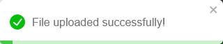

Onnistuneen lähetyksen jälkeen tehty postaus löytyy `profile` valikosta.

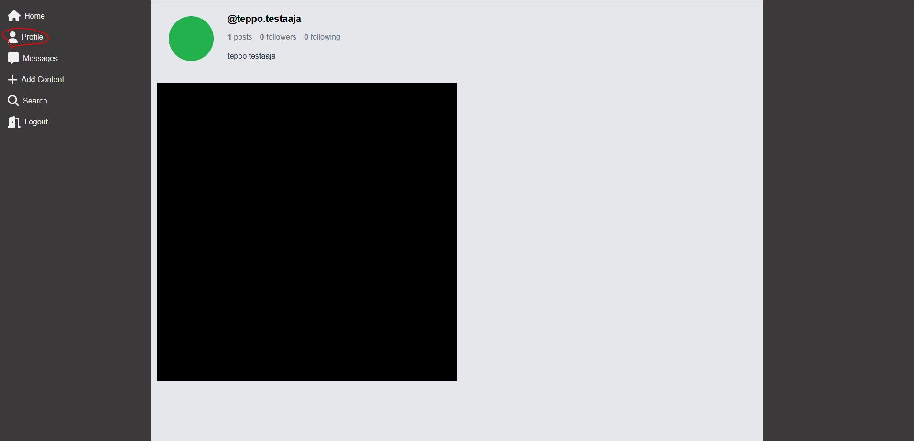

Painamalla kuvaa aukeaa postausmodaali, jossa postausta voi kommentoida tai siitä voi tykätä painamalla sydäntä alareunassa. Myös kommenteista voi tykätä painamalla kommentin vieressä näkyvää sydäntä.

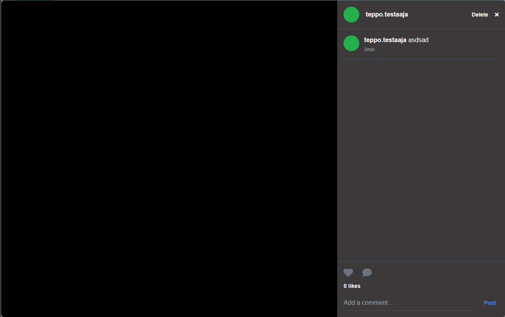

Haku löytyy valikosta vasemmalta. Painamalla search aukeaa hakuvalikko, jossa voi hakea käyttäjiä tai hashtageja. Hakutulosta klikkaamalla käyttäjä ohjataan joko toisen käyttäjän sivulle tai listaan, jossa on postauksia kyseisellä hashtagilla.

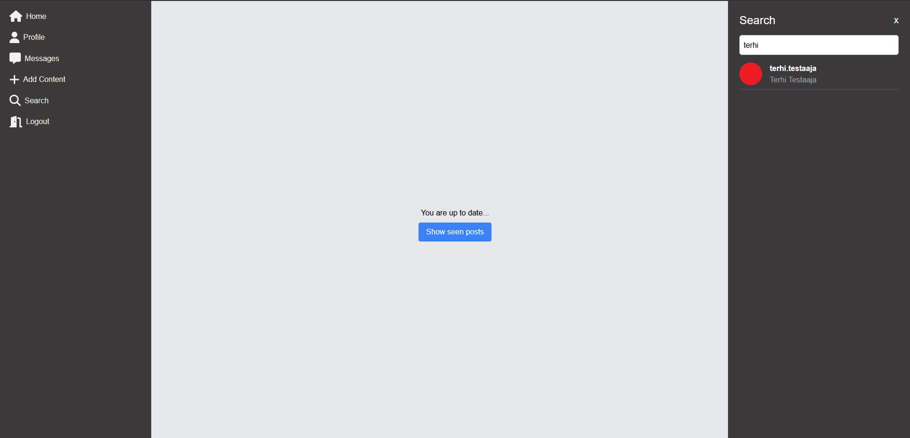

Toisen käyttäjän sivulla näkyy käyttäjän postaukset, joita voi kommentoida ja tykätä. Lisäksi käyttäjää voi seurata painamalla `Follow` nappia tai `Unfollow`, jos haluaa lopettaa seuraamisen. Seurattujen käyttäjien postaukset näkyvät etusivulla ja ne poistetaan näkyvistä kun käyttäjä on ne nähnyt.

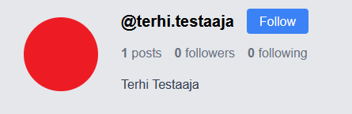

Painamalla `Followers` tekstiä käyttäjän sivulla aukeaa lista käyttäjistä, jotka seuraavat kyseistä käyttäjää.

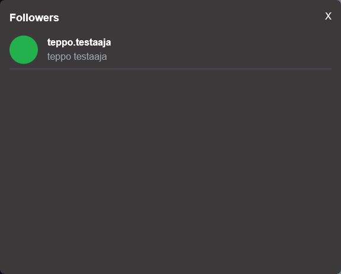

Vastaavasti myös `Following` tekstistä painamalla aukeaa lista käyttäjistä jota tarkasteltava käyttäjä seuraa.

Kun käyttäjä seuraa muita käyttäjiä ja näillä käyttäjillä on postauksia, näkyvät postaukset etusivulla `/` listana.

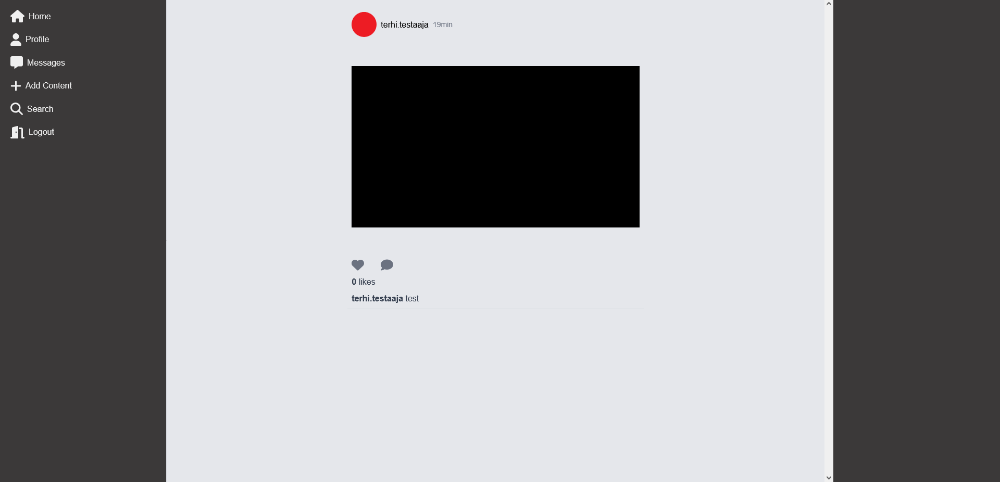

Kun käyttäjä on nähnyt postauksen se merkitään nähdyksi eikä sitä näytetä enää ellei käyttäjä erikseen paina `Show seen posts` nappia.

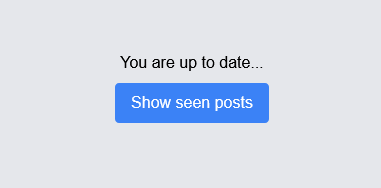

Sovelluksessa voi lähettää viestejä käyttäjien välillä valitsemalla `Messages` valikon.

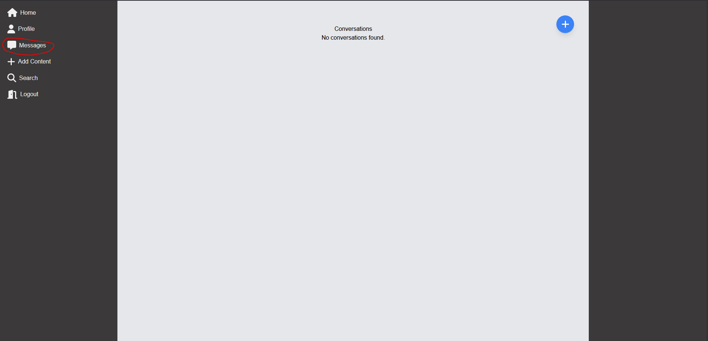

Mikäli käyttäjällä ei ole olemassa olevia keskusteluja tai käyttäjä haluaa aloittaa uuden keskustelun, onnistuu se painamalla plus ikonia yläreunassa.

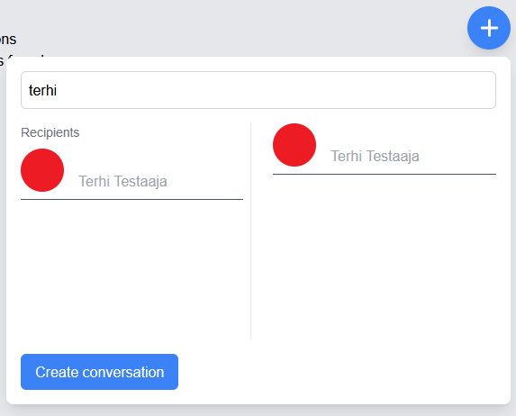

Käyttämällä hakua voi etsiä vastaanottajia ja lisätä niitä vastaanottajien listalle. Kun kaikki vastaanottajat ovat lisätty keskustelu aloitetaan painamalla `Create conversation` nappia.

Käyttäjän omat viestit näkyvät oikealla vihreällä taustavärillä ja muiden keskustelijoiden viestit näkyvät vasemmalla ja niissä näkyy lähettäjän käyttäjänimi. Omat viestit voi poistaa painamalla punaista roskakorin kuvaa.

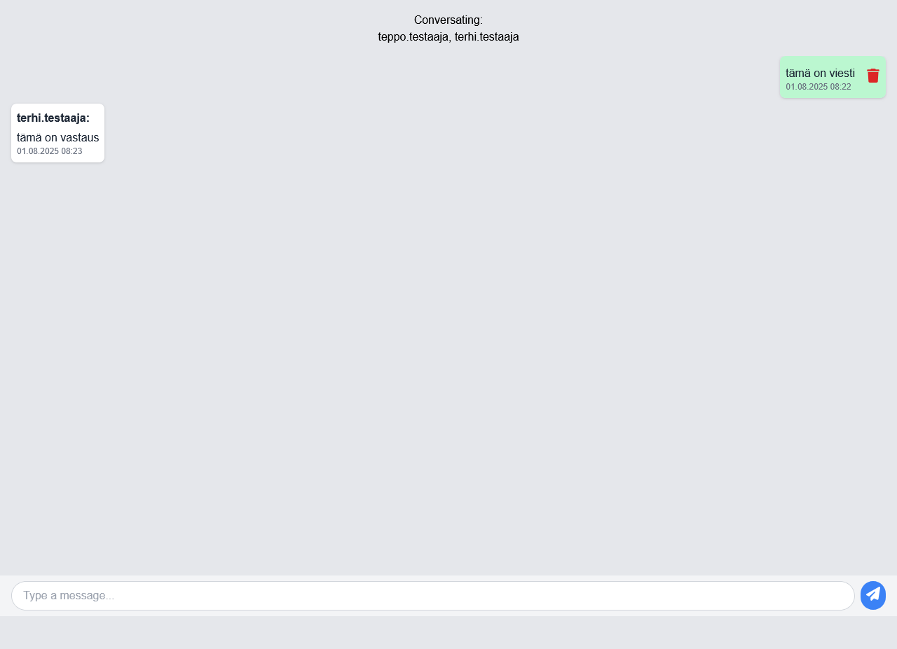

Kun Käyttäjällä on olemassa olevia keskusteluja näkyvät ne listalla. Jokainen keskustelu on listalla omana elementtinään ja elementissä näkyy keskustelun osapuolet, viestien määrä ja viimeisin viesti (jos viestejä on). Keskustelun aloittaja voi poistaa keskustelun painamalla punaista roskakoria. Keskustelu poistetaan kaikilta osapuolilta.

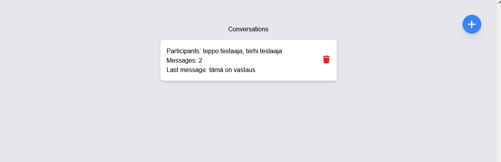

Lopuksi käyttäjä voi kirjautua ulos sovelluksesta painamalla `Log out` valikkoa vasemmalta


Silloin käyttäjän sessiotiedot poistetaan ja käyttäjä ei enää pääse käyttämään sovellusta ilman uudelleen kirjautumista.
